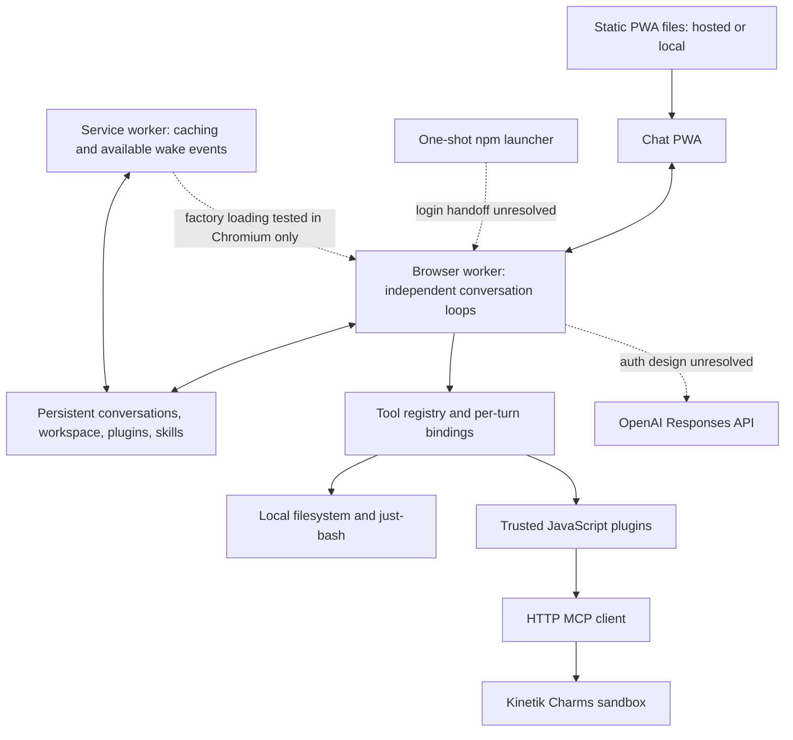

# Kinetik OSS: v1 design

Status: accepted target design, with a local prototype implemented 2026-09-30. See [README.md](README.md) for the shipped scope and commands.

This document records the accepted product behavior. Interface sketches and implementation choices are proposals. [RESEARCH.md](RESEARCH.md) records evidence and feasibility gaps. No authentication, deployment, or production changes have been performed.

## Objective and release boundary

A small open-source agent with a chat PWA, a TypeScript agent loop running in browser workers, a persistent virtual filesystem, and `just-bash`. It works locally by default. An optional JavaScript plugin connects Kinetik Charms and replaces workspace tools with tools operating in the user's Charms sandbox.

The model runs at OpenAI; "local" describes the browser agent, its state, and default tool execution. Remote MCP tools run at their providers. WASM is optional for future tools, not a requirement for the loop.

Official ChatGPT subscription support remains a requirement, but the selected one-shot launcher and browser credential storage conflict with the current documented credential rules. The design must not claim that integration works or is officially supported until this conflict is resolved. A persistent bridge is not an accepted fallback.

## Accepted scope

| Area             | v1 decision                                                                                                                                   |
| ---------------- | --------------------------------------------------------------------------------------------------------------------------------------------- |
| UI               | Chat-oriented PWA for desktop and mobile; generated files downloadable from chat. No editor/file-panel requirement.                           |
| Hosting          | `https://kineto.app/kinetik-oss`. Shared-origin implications accepted for now. Also easy local hosting.                                       |
| Distribution     | One npm command, Node.js required; environment-variable configuration. Package name not yet reserved.                                         |
| Launcher         | Login, open the PWA, then exit the entire process. No daemon, credential bridge, or agent runner left behind.                                 |
| Runtime          | TypeScript browser worker core, UI separate; background execution when the browser permits it, durable recovery after suspension.             |
| Local workspace  | One persistent virtual filesystem shared by all conversations, with file import/export. It is not unrestricted access to the host filesystem. |
| Shell            | `just-bash` and its browser-supported commands. No native OS shell or arbitrary host binaries.                                                |
| Core tools       | `exec`, `read`, `write`, `edit`, `list`, and `read_skill`.                                                                                    |
| Conversations    | Separate histories; parallel agent turns across conversations.                                                                                |
| Steering         | A new message in an active conversation is incorporated at the next safe point.                                                               |
| Execution policy | Enabled tools run automatically. Show tool activity and offer Stop.                                                                           |
| Cancellation     | Stop generation and request cancellation of active tools. Show work whose cancellation is unconfirmed.                                        |
| Recovery         | Query a tool's status when supported. If an interrupted call's outcome is unknown, pause for a user decision; do not blindly repeat it.       |
| MCP              | Client-owned HTTP MCP connections; no implicit tool replacement from a server's tool name.                                                    |
| Plugins          | Executable JavaScript, a small interface, optional replacement mappings, native skills. Trusted application code, without an isolation layer. |
| Installation     | Direct HTTPS URLs and GitHub links to a plugin folder or file. Ready-to-run JS plus a small manifest; no browser TypeScript/npm build system. |
| Plugin updates   | Explicit update, cached installed bytes, changes applied between turns.                                                                       |
| Plugin scope     | App-wide. Each in-progress turn retains its tool/plugin configuration.                                                                        |
| Conflicts        | Last explicitly enabled plugin wins for a replaced tool; settings show ownership. Disabling it restores the previous enabled provider.        |
| Charms           | Optional plugin; enabling it activates all its declared workspace replacements together. No silent local fallback.                            |
| Skills           | Local native catalog plus plugin skills. Names, descriptions, and paths in model instructions; full content through `read_skill`.             |
| Skill refresh    | Check before processing every incoming message, including steering messages. Update files/catalog when changed.                               |
| Sync failure     | Continue using cached skills, with a brief warning. On first use without a cache, continue without that plugin's skills.                      |

Deferred: MCP Apps/iframe UI, goals, routines/jobs/monitors, general external-event scheduling, a VM agent host, native host execution, and a full background-task product. Existing remote tool jobs still need enough tracking to support cancellation and recovery. Native skills were brought back into v1 during the interview.

## Small architecture



Keep these responsibilities distinct without turning them into a framework:

- **Agent core:** context construction, streamed output, tool dispatch, steering, cancellation, checkpoints.
- **Browser host:** worker lifetime, app ownership across tabs, storage, filesystem adapter, lifecycle recovery.
- **Provider adapter:** OpenAI request encoding, response events, model catalog, and authentication boundary.
- **Tool/plugin registry:** installation, activation order, concrete tool bindings, native skill contributions.
- **UI and launcher:** rendering/controls and one-shot startup respectively.

One browser-host coordinator prevents duplicate execution across tabs. That coordinator can run multiple conversations concurrently. One conversation has one active loop. Persist messages before processing them; the UI is never the authoritative execution record.

### State and filesystem

Use browser persistence for conversations, pending messages, tool-call records, installed plugin bytes, enable order, and skill snapshots. IndexedDB is a candidate for the initial implementation; choose the final filesystem adapter through a small integration test rather than introducing a second filesystem library by default.

All local tools and every `just-bash` instance must use the same backing filesystem. Saving separate full in-memory snapshots after parallel commands would lose changes; use transactional filesystem operations. Atomic file operations do not make an entire shell script or read-modify-write sequence atomic. Concurrent conversations may still overwrite the same file; this is an accepted consequence of a shared workspace, and should be visible through tool results and optional version checks.

Browser storage is tied to its origin. The hosted PWA and a localhost installation have separate data. There is no cross-device or hosted-to-local synchronization in v1. Use a stable local port/origin; importing/exporting data can be added without implying a shared database.

### Turn behavior

1. Persist the user message. Refresh enabled plugin skill sources before incorporating it into model context.
2. Start a new conversation turn, or queue steering for the active turn's next safe point.
3. Snapshot active tool bindings and plugin code revisions for a new turn. Skill refresh on a steering message may update the next model request's skill catalog without replacing in-flight tool implementations.
4. Build instructions from the base prompt, actual tools/environment, and available native skills. Send only skill metadata until content is requested.
5. Stream model output and persist complete response/tool-call records. Execute tools automatically.
6. Record tool intent before dispatch, plus provider identity and any returned operation ID. Append results before the next model request.
7. At safe points, incorporate pending messages and refreshed skill metadata. Repeat until finished, stopped, failed, or awaiting recovery input.

Do not claim reliable continuous background execution. Persist at each durable boundary and resume on the next available browser activation. A suspension after a side effect but before its result was saved creates an unknown outcome, not proof that nothing happened. Read-only calls may be retried when safe; uncertain writes/commands follow the accepted recovery policy.

Stopping a local CPU-bound command may require terminating its isolated execution worker. Terminating the one shared runtime would incorrectly stop unrelated conversations. A service worker cannot itself spawn a dedicated worker, so the headless path cannot assume this isolation mechanism. Use bounded/cooperative execution there and verify cancellation behavior; page-owned execution workers are an option while the UI is alive. Cancellation/reconciliation uses the operation's original provider, even after app-wide plugin settings change. See the worker limitations in [RESEARCH.md](RESEARCH.md).

## Plugin contract proposal

Prefer ordinary functions and records over a general hook/event framework. These are illustrative types, not a committed SDK:

```ts
type WorkspaceTool = 'exec' | 'read' | 'write' | 'edit' | 'list';

interface Plugin {
  tools?: Record<string, ToolDefinition>;
  replacements?: Partial<Record<WorkspaceTool, string>>;
  skills?: SkillSource;
  dispose?(): Promise<void>;
}

interface ToolDefinition {
  description: string;
  inputSchema: JsonSchema;
  execute(input: unknown, context: ToolContext): Promise<ToolResult>;
}

interface SkillSource {
  sync(previous: SkillSnapshot | undefined, signal: AbortSignal): Promise<SkillSnapshot>;
}
```

`ToolContext` carries cancellation and a way to checkpoint a provider operation ID. The host can expose a small MCP connection helper to plugin initialization. Tool result types retain text, structured data, errors, and artifact references. Final signatures should follow the Charms adapter prototype, not anticipate every future plugin.

The manifest needs a stable ID, interface version, display version, and relative entry filename. Resolve a GitHub branch/tag to one commit when installing; preserve the original source locator for explicit updates. Folder links locate the manifest; entry-file links locate its sibling manifest. Reject ambiguous layouts with a useful message. Do not execute HTML from a GitHub `blob` page.

Store the exact installed JS bytes and their digest locally. Check compatibility before activation. A digest identifies installed bytes; it is not proof the author is trustworthy. For the smallest format, require one self-contained bundle with no runtime npm resolution.

Proposed format: a trusted factory body that returns the plugin object, evaluated by the host with its initialization context. Ordinary ESM dynamic imports cannot run in a service worker. The factory approach passed a narrow Chromium test, including reload from cache after worker termination; it still needs cross-browser tests and a scoped worker CSP permitting string compilation. This is a packaging proposal, not a new plugin sandbox. See [RESEARCH.md](RESEARCH.md) and the [probe](research/service-worker-plugin-probe/README.md).

Replace a tool's schema, description, and handler as a unit. Validate that each mapping targets a tool supplied by that plugin before publishing the new registry. New ordinary MCP tools get namespaced names. `read_skill` is a native-catalog operation, independent of workspace `read` replacement.

The activation order is persisted. Installing or updating bytes does not silently promote a plugin above a more recently enabled plugin. Old code stays available until its active turns and operations release it; new turns use the new registry revision. Plugin failures do not fall through to a lower-priority implementation.

Trusted plugins can access origin storage and make network requests; this small interface is a convenience contract, not a security boundary. Hosting under `/kinetik-oss` does not isolate these privileges from the rest of `kineto.app`. The owner accepted that deployment choice for now.

## Charms plugin and native skills

The optional plugin declares these replacements as a group:

| Agent tool | Charms tool          |
| ---------- | -------------------- |
| `exec`     | `charms_exec`        |
| `read`     | `charms_files_read`  |
| `write`    | `charms_files_write` |
| `edit`     | `charms_files_edit`  |
| `list`     | `charms_files_list`  |

The plugin handles authentication, tool schemas, argument/result adaptation, continuation reads, remote job IDs, polling, and cancellation. Switching to Charms does not copy local files to the sandbox. Its filesystem is separate and its execution may consume Kinetik credits independently of model usage.

For skills, the plugin internally uses Charms discovery/loading. Those MCP calls are synchronization work, not the agent's skill-discovery interface. The model sees native skill metadata and uses `read_skill`.

Proposed synchronization:

1. Before each incoming message, query the user's installed catalog. Follow pagination; an incomplete page is not a complete list.
2. Compare `catalog_version` and `charm_version`, then fetch changed/new skill instructions. Preserve full instructions across continuation reads.
3. Always refresh `kineto.connections` and `kineto.agents`: their live user-specific bodies change independently of catalog versions.
4. Stage a coherent catalog and publish it atomically. Remove absent entries only after a complete successful listing. On failure, keep the prior usable snapshot and surface a sync warning.
5. Rebuild the available-skills instruction block with names, descriptions, and native paths. Keep catalog generations consistent across concurrent syncs.

Namespace local skill paths by plugin to avoid collisions, for example `skills/charms/<name>/SKILL.md`. Retain the source execution directory separately, e.g. `.agents/skills/<name>` in the remote sandbox. `read_skill` resolves native skill content/resources; Charms commands still use remote execution paths. Do not rewrite arbitrary skill prose blindly. In particular, cached instructions must not imply that remote scripts are installed in the browser workspace.

The initial adapter must determine which supporting files need local copies versus native on-demand reads. This is an implementation proposal, not permission to omit skill content. Import all installed skill entries; disclose unsupported capabilities. Some existing Charms skills depend on rendering or integrations beyond v1. Importing them does not implement MCP Apps.

## Delivery and authentication

The implemented npm command serves the bundled PWA locally. The following hosted-startup variables remain design proposals; consult [README.md](README.md#configuration) for the actual launcher configuration:

| Variable                       | Intended purpose                                                                |
| ------------------------------ | ------------------------------------------------------------------------------- |
| `KINETIK_APP_URL`              | Hosted or self-hosted PWA address; default `https://kineto.app/kinetik-oss`.    |
| `KINETIK_LOCAL`                | Serve the bundled PWA locally instead of opening the hosted copy.               |
| `KINETIK_BIND`, `KINETIK_PORT` | Local static delivery address; fixed port by default.                           |
| `KINETIK_OPEN_BROWSER`         | Open a browser, or print the address on another machine.                        |
| `KINETIK_PUBLIC_URL`           | Externally reachable HTTPS address when local delivery is exposed deliberately. |

Names are provisional. These configure delivery and do not create an always-on runner. A PWA cannot read the launcher's environment directly; pass only public runtime configuration through a startup handoff or local config response. Never place credentials in URLs or a served config file.

Hosted startup needs no local static server after launch. For fully local startup with process exit, the PWA must finish service-worker activation and caching its complete app shell before the server closes. Its fixed localhost origin must remain usable from cache. Offline retention and reopening require browser tests; installation is not a storage-durability guarantee.

Running the launcher on another machine does not make `127.0.0.1` in a phone's browser reach that machine. A plain LAN HTTP address is also not equivalent to trusted localhost for PWA features. Remote delivery needs HTTPS, and mobile/remote OpenAI login remains unresolved under the documented loopback callback and credential rules. Do not advertise that flow as working merely because it is configurable.

No persistent bridge, alternate billing provider, or native wrapper is silently substituted. An OpenAI-supported browser credential flow or an explicit product decision is needed before shipping subscription auth.

## Verification plan

These are target acceptance checks. The prototype automates the local filesystem, concurrency, plugin, skill, cancellation, recovery, and offline-launcher cases. Live Charms, authentication, physical-device lifecycle, and multi-browser acceptance remain unverified:

1. Local file write/read/exec share bytes; data survives restart; parallel writes do not lose unrelated files through snapshot replacement.
2. Two conversations execute concurrently, while duplicate tabs never execute the same turn twice. Steering is applied at a safe point.
3. Install a real plugin from HTTPS and GitHub folder/file links; use it offline from cached bytes; explicit update preserves active turns and activation priority.
4. Charms replacements use one remote workspace. A failed remote tool does not invoke its local counterpart. `read_skill` remains native.
5. Skills update before messages, dynamic inventory refreshes, partial listings do not delete skills, and outages retain the last usable snapshot.
6. Stop cancels generation and requests tool cancellation without stopping another conversation. Lost remote results are reconciled or require a user decision, never blindly repeated.
7. Kill/restart the browser host at model/tool boundaries and verify recovery. Test desktop and mobile lifecycle behavior separately.
8. Prove local static startup can exit and reopen offline, and that installed plugins can load in the chosen background host.
9. Authenticate and stream one real ChatGPT-plan response only after resolving the documented storage conflict; then verify refresh, logout, and account switching.

The present deliverable includes the local prototype, tests, build scripts, package launcher, and OSS documentation. It uses a deterministic mock model; real ChatGPT login and the provider-specific Charms integration remain pending.
