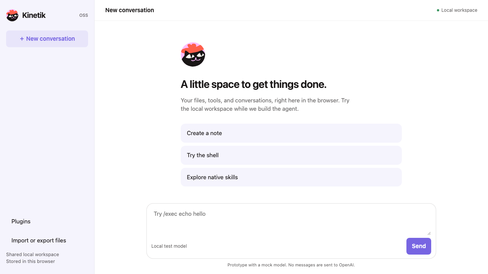
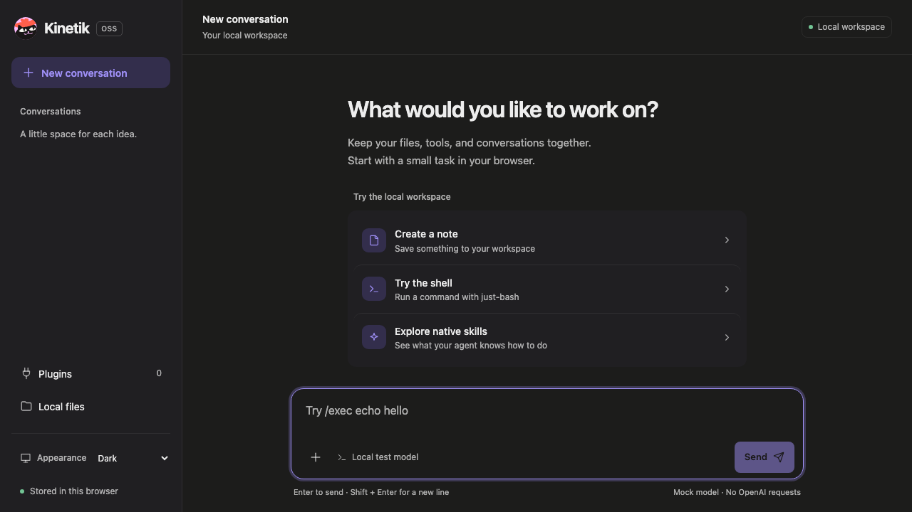

# Kinetik OSS

A small browser agent runtime with a persistent workspace, just-bash, native skills, background work, MCP Apps, and JavaScript plugins that can replace its tools. The chat interface reuses Kinetik Charms colors, panels, action rows, and icons.

**By default, this version uses a deterministic local test model.** Hosts can enable experimental browser ChatGPT sign-in or a separate credential helper. Browser mode stores login credentials in a dedicated browser-local IndexedDB database. Model requests go directly to OpenAI or through an optional same-origin stateless relay. Login survives app restarts and updates; logout removes the saved session. Clearing browser storage or revoked access requires signing in again. It is not presented as an officially supported browser integration. The launcher still exits completely. See [hosting configuration](docs/deployment.md#connections-and-guided-setup).

| Light                                       | Dark                                            |
| ------------------------------------------- | ----------------------------------------------- |
|  |  |

## Native apps

The SolidJS interface also builds with Tauri 2. Android is available for testing; iOS needs physical-device acceptance testing. Windows remains experimental because native onboarding currently fails its startup check. Native adapters provide system-browser sign-in, protected credentials, native file pickers, and Android foreground work. See [native build and release instructions](docs/native.md). Device acceptance testing is separate from the browser test suite.

## Run locally

Requires Node.js 22.12 or newer and a modern browser with Service Workers, Web Locks, and IndexedDB. Chromium desktop and mobile-sized Chromium are automated test targets.

```sh
git clone https://github.com/kineto-app/kinetik.git
cd kinetik
npm ci
npm run build
npm start
```

The launcher opens `http://127.0.0.1:4173/`. Once the PWA confirms its offline assets are cached, **the entire launcher process exits**. Keep the same address to reopen it. Browser site-data deletion removes files, conversations, and plugins; export important files first. Install the PWA through your browser's app-install action if desired.

For development with a running server:

```sh
npm run dev
```

To keep the production static server available, including for plugin development:

```sh
KINETIK_KEEP_ALIVE=1 npm start
```

The npm package is prepared but has not been published. To try the actual distributable without publishing:

```sh
npm pack
npx --package ./kinetik-oss-0.1.0.tgz kinetik-oss
```

No global installation, account, API key, or external service is needed for the local prototype. The bundled example plugin works offline; third-party plugin installation and refresh require network access.

## App updates

The app checks for new builds on opening, on returning to the foreground, on reconnecting, and every 15 minutes while visible. A downloaded build shows **Update available**. Click **Update** to activate it and reload open app tabs. Checking or downloading an update does not reload the app. Your files, conversations, plugins, appearance, and each tab's unsent message are retained.

If foreground or background work is running, the update stays available and asks you to try again after it finishes. An installation failure or an offline check leaves the current build usable. Once downloaded, an update can be applied offline. As with other service-worker PWAs, closing all app tabs lets the browser activate a waiting build on the next launch.

For a local installation, pull the new source, run `npm ci && npm run build`, then `npm start` at the same address. The launcher exits once the new app files finish caching; the Update button remains usable afterward. There is no automatic download from GitHub or npm.

## Appearance

Open **Settings** and switch **Appearance** between **Light**, **Dark**, and **Auto**, which follows the device. The preference is saved in this browser, shared across app tabs, and applied before the interface loads. On mobile, open the chat menu to find Settings. The drawer supports Escape and keyboard focus stays inside it while open.

The interface uses the Charms renderer’s tinted panels, compact action rows, upload controls, and icon strokes. Small button text uses a slightly deeper purple for readable contrast. All theme values live in [the design tokens](src/ui/tokens.css). Frosted header, sidebar, composer, and dialogs derive their colors from those tokens. Shared buttons use rounded controls. New messages and dialogs use brief transitions; the device’s reduced-motion preference disables them. The composer starts at one line and grows with the message. Its main button shows Stop during work and switches to Send when you type steering; Stop remains available in the work options. Foreground tool calls share an expandable activity row, while files and embedded apps remain visible. Widgets rendered after a background job completes also appear in chat; their raw tool output stays hidden. The layout follows the visual viewport so the keyboard leaves the header and composer reachable.

Replies format headings, lists, tables, links, and code. Copy a complete reply or an individual code block. Raw HTML and remote images remain inactive. When you scroll up, new content leaves your reading position in place; the down-arrow **Latest message** button returns you to the end. You can send another message while Kinetik works to steer the current turn.

## Try it

Choose **Create a note** or **Make a packing list**, then send the suggested message. These are fixed preview examples: they create real local files but do not understand arbitrary requests. Shared text, Markdown, and images appear inline using the Charms file layout, with compact Copy, Download, and Expand controls. Other file types use a clickable filename/size row. Expand opens a larger preview; unsupported formats remain download-only. Use the composer’s **Add files** button to upload one or more local files; photos show as thumbnails before sending and as a swipeable row with a full-screen viewer after. The model button inside the composer chooses the ChatGPT model and its reasoning level. Creating or editing a file does not attach it to chat: the agent explicitly shares finished deliverables using `show_file`. New local attachments preserve the bytes at sharing time, including after later edits or reloads. Charms disables this local tool and uses its existing sharing tools and widgets.

Messages show their local send time. A live elapsed timer stays above the composer, and completed replies retain a “Worked for” duration. Turn timers survive steering and recovery; elapsed time includes connection waits. Background jobs have separate timers. Older replies without stored durations do not invent them.

Foreground tools appear in a collapsed activity card between narration messages. Repeated actions share a row, with individual calls available on expansion. Each call has a short explanation and optional technical details. A successful retry of the same action and arguments resolves its earlier failure inside that group; unrelated and uncertain outcomes stay visible. Widget refresh calls stay out of the agent activity timeline; interactive MCP cards remain visible. **Settings → Connections** lists ChatGPT, Charms, and installed plugins. Each has its own page with status, version, Update, Turn on or Turn off, and Disconnect (Sign out for ChatGPT); **Add a connection** takes a custom plugin link with optional JSON options. The sidebar **Connections** button runs the guided setup while a connection is missing and otherwise opens this page. The preview limitation stays visible beside the message box and in the Settings account row.

For developers, the test model also understands explicit commands so runtime behavior is reproducible:

```text
/exec printf "hello from Kinetik\n" > note.txt; cat note.txt
/read /workspace/note.txt
/list /workspace
/skills
/read_skill skills/local/workspace/SKILL.md
/tool edit {"path":"/workspace/note.txt","oldText":"hello","newText":"hi"}
```

`/write /workspace/note.txt` followed by a new line and content replaces a file without sharing it. `/show_file /workspace/note.txt` explicitly attaches a snapshot to chat. Shift+Enter inserts a line in the composer. `/tool plugin__tool {"argument":"value"}` invokes another enabled tool.

Conversations run concurrently and share `/workspace`. User messages and background completion events use the same durable steering queue. They join the next model request together at a safe boundary after the current tool finishes. A message arriving during inference prevents the stale response from executing a tool; the next request includes the new steering context. Stop aborts model work and requests tool cancellation; an uncertain effect stays visible for review. On a worker restart, uncertain calls pause rather than execute twice. Resolving without retry continues; retry is an explicit user action.

Files live in a virtual filesystem, not arbitrary host folders. Import/export handles files up to 4 MiB per import. This small-workspace implementation persists each operation, with limits of 16 MiB and 2,000 entries. It delegates shell filesystem semantics to just-bash's InMemoryFs, including its replacement behavior for writes through hard-linked paths. Whole scripts are not transactions.

The shell exposes a selected set of file/text commands, pipes, and shell syntax. Network commands, Python, JavaScript execution, SQLite, gzip, and native processes are excluded. Commands are bounded to 15 seconds; plugin calls receive a 30-second timeout. Trusted JavaScript can ignore cancellation or block its worker, so this is not a hard sandbox guarantee.

## Long tasks and long chats

Each reply shows how long the agent worked and how many tokens it used. When a chat fills about three quarters of the model's context window (the window comes from the ChatGPT model catalog; 200k tokens otherwise), the agent summarises everything before your latest request into short notes and keeps the latest request and its tool calls word for word. While it summarises, the activity line reads "Summarising earlier messages…". A quiet "Earlier messages summarised" line marks the spot; the older input is archived on the device. If the model still reports that a request is too long, the agent summarises once and retries; a second failure stops the turn and suggests a new chat. Type `/compact` to summarise on demand. When the chat runs on ChatGPT with browser sign-in, Kinetik first asks ChatGPT's own compaction endpoint (`/responses/compact`, through the relay when one is configured) and keeps its opaque result; the divider then reads "Earlier messages summarised by ChatGPT", and a custom model will not see those earlier messages. Any error falls back to the local summary, and if the first request after a ChatGPT compaction is rejected, the archived input is restored and that model goes back to local summaries.

While the agent works, the line above the composer names the current action and the step ("Running a command · step 3"). For ChatGPT models with a reasoning level, Kinetik asks for a reasoning summary: while the model thinks, a muted note in the chat shows the heading and latest text of its summary, and the line above the composer shows the heading. The note disappears when the reply starts; summaries are not saved. If a model rejects the request for summaries, Kinetik asks once more without them and stops asking that model. Streamed reply text, reasoning summaries and step changes reach the open window as events, so the window does not reload the whole app state for each word; anything saved still triggers a full reload. Model input is stored in append-only pieces next to the chat, so a step saves only what it added instead of rewriting the whole history.

Tool calls that cannot have changed anything — a call to a tool that does not exist, arguments that fail the schema, or an error from Kinetik's own `read`, `list` or `read_skill` — go back to the agent as an error result so it can correct itself; the activity line counts them as "handled". Errors from tools that may have had side effects still pause the chat for review. The model may ask for several of Kinetik's read-only tools (`read`, `list`, `read_skill`) in one response; they run at the same time and their results return together. A batch that includes any other tool runs nothing and every call is sent back to be made one at a time. The `delegate` tool hands a reading or research task to a helper agent with a fresh history and only those read-only tools; its findings come back as the tool result, its tokens count toward the turn, and the activity line shows "Asking a helper · helper step 2". Because these tools change nothing, a restart runs an interrupted read or helper again instead of asking for review.

A turn stops after 60 steps, or earlier when the agent repeats the same call with the same input more than three times.

## Custom OpenAI-compatible model

ChatGPT sign-in is the main way to chat. For testing other models, **Settings → ChatGPT → Advanced** takes one OpenAI-compatible endpoint that speaks Chat Completions (`/chat/completions`), such as OpenRouter, Ollama, LM Studio or vLLM: its address, the model name, an API key (optional for servers on the device), the context window (128k by default) and whether the model reads photos. The composer's model menu then lists it under "Custom". The key is stored like the ChatGPT tokens: in secure storage in the apps and never in an export; in a browser, installed connections can read it. A turn keeps the model it started with even if you switch mid-turn. The chat history is translated per request, so a chat can move between ChatGPT and the custom model; ChatGPT's encrypted reasoning and its compaction summaries are not sent to the custom model. A wrong key pauses the chat with **Check API key**, which opens that settings section.

## Photos, questions, approvals and memory

Attached photos reach the model as images, not only as file paths, when the selected ChatGPT model accepts images (the model catalog says which do); other models get a note that a photo was attached. The agent still gets the file path, so a tool can use the original. Each request carries at most the 8 newest photos and 4 MB of them; older photos are replaced by a note to stay within the app's image budget.

While the agent works, the clock button next to Stop sends your message **after** the current work instead of steering it now. The message shows "Queued · runs after the current work" until its turn starts.

The agent can stop and ask. The local `ask` tool shows a question with two to six answer buttons; an MCP tool that a server marks `destructiveHint: true` shows its input with **Approve** and **Decline** and runs only after Approve. The chat status reads "Waiting for your answer", a restart keeps the question, and sending a new message instead tells the agent the question went unanswered.

**Settings → Memory** holds short notes about you — at most 4000 characters — that every chat reads first. The agent can propose a new version with the `remember` tool; nothing is saved until you choose **Save to memory**.

**Settings → Notify me when work finishes** asks for notification permission and then shows a system notification when a reply is ready or the agent asks a question, but only when no Kinetik window is in front. The web app shows it from the service worker; the Android app uses a native notification. iOS and desktop do not notify yet.

## Plugins and skills

Open **Settings → Connections → Add a connection**, select **Use demo connection**, add it, then choose **Turn on**. Its `exec` replacement echoes what it received instead of running a shell. Choose **Turn off** to restore local execution. Its skill appears in `/skills` and loads through `read_skill` independently of workspace replacements.

Plugins are trusted JavaScript. They can access the app's origin storage and network. Installation downloads code; enabling permits execution. Updates are explicit, and active turns retain their code/tool bindings. Skill sources are checked for every message and cached on failure. The last explicitly enabled plugin wins a replacement; updating code does not change priority.

Supported install sources are direct HTTPS manifest/folder/entry URLs and public GitHub repository/folder/file links. HTTP is accepted only for loopback development. GitHub refs resolve to a commit, then installed source bytes and their digest are stored locally. Private repository authentication and runtime npm/TypeScript compilation are not implemented.

See [the plugin contract](docs/plugins.md) and [the bundled example](public/plugins/example/plugin.js). A minimal [HTTP MCP plugin](public/plugins/mcp/plugin.js) is also included. It uses a supplied endpoint and optional bearer token. MCP Apps render in isolated iframes and can call app-visible tools on their own server. The host shares its theme, colors, font, and radius tokens through the MCP Apps style contract, including live theme changes. Transparent widget areas blend into the chat. Widgets can open a fullscreen panel and return to their inline view without reloading. The bundled Charms connection supports OAuth authorization code with PKCE and guided setup. Legacy SSE transport is not included. Direct browser connections need server CORS support; a host may provide a fixed-endpoint relay. Protocol fixtures do not prove every live Charms workflow.

## Background processes

The `background` tool runs a long tool call independently of the agent turn. Start with `{"action":"start","tool":"exec","input":{"command":"sleep 5; echo finished"}}`. It immediately returns a job ID, letting the agent finish its turn or do other work. When execution finishes, the runtime saves the result and wakes the **same conversation** once. The agent does not poll for completion. A compact activity indicator shows running background work. Job receipts, raw completion results, and tools called while handling a background result are internal context, not chat history. Only the agent’s useful final reply appears in chat. A completion arriving during foreground work steers that conversation rather than starting a competing agent loop. With the bundled test model, try `/bg sleep 5; echo finished`.

`background` also accepts `{"action":"list"}` and `{"action":"cancel","id":"..."}` for the current conversation. Stop cancels its running processes. Execution uses the selected provider, including plugin tool replacements. The default timeout is five minutes, configurable through `timeoutMs` up to fifteen minutes, with at most eight running jobs per conversation. Results include output and errors; cancellation and interruption warn about possible partial effects.

Local jobs outlive the model turn, not browser termination. The worker event remains open while jobs run, but the browser may terminate it. On restart, lost local jobs report interruption and are never silently replayed. Remote providers can reconnect through persisted operation IDs and optional `recover`/`wait` hooks. A completed result awaiting delivery survives restart and uses a stable event ID to prevent duplicate messages. Transient model connection failures preserve the unfinished turn instead of marking it stopped. A remote job with a saved operation ID waits through a transport failure and reconnects to that same job. Returning to the app, coming online, or choosing Retry resumes interrupted work; a visible, online app retries transient model failures after 2 seconds, then backs off up to 30 seconds between attempts. Remote jobs are also checked every 30 seconds. This does not rerun completed tool calls. Intermediate assistant narration remains in the conversation and separates the surrounding tool activity groups. Invalid background tool requests are returned to the agent for correction before any job starts. Foreground remote calls with a saved operation ID recover their existing result after transport failures. If browser storage was cleared or access was revoked, sign in again to continue. Completion cannot automatically resume an explicitly stopped conversation or bypass a pending tool review.

The Charms adapter waits for remote jobs internally using its status API. This polling does not invoke the model. A provider with a completion stream can implement `wait` using that stream instead. Closed-browser remote wakeups still require an external push sender; the bundled adapter does not supply one.

## Routines and events

Open **Routines** in the sidebar to manage scheduled work and goals. Detached background processes have no separate menu or job list:

- **Task:** one independent conversation. With the current test model, use an explicit command such as `/exec echo done > /workspace/result.txt`.
- **Goal:** continue an objective for a bounded number of runs. An integrated LLM would judge completion through the `automation` tool; the bundled test model cannot reason about goals.
- **Job:** a prompt on an interval or named event, with an explicit run limit.
- **Monitor:** watch the result of `read` for a file path on an interval. The first successful read establishes a baseline; later changes trigger a conversation. It uses the currently enabled read provider, so a Charms replacement watches the remote file.

Schedules, events and dispatches survive worker restart. Missed intervals coalesce into one run. Pause stops active work and prevents future dispatches; resolve uncertain tools in their conversation before resuming. Each dispatch has a stable conversation/message ID to avoid duplicate execution after restart. View the latest result or remove an automation from its row. Removal preserves conversation history. The UI shows run counts and status.

Browser suspension still applies. A page sends a wake tick every 15 seconds. Service-worker sync, periodic sync and push handlers can also wake work when the browser delivers those events. There is no guaranteed closed-app scheduler or precise alarm on mobile. A push sender is external: under **External wake events**, enter its public VAPID key and download this browser's subscription. Send encrypted Web Push payloads shaped as `{ "id": "unique-id", "name": "inbox.new", "text": "details" }`. Push displays a notification. Events target the matching active routines present when they arrive. The latest 1,000 event IDs are deduplicated, and up to 100 events can wait in the queue. Browsers and operating systems control delivery.

Plugins can emit events with `await host.emit(name, text, uniqueId)`. The `automation` tool exposes list/create/status/remove/emit for model integrations. Native app UI and RPC use the same durable scheduler.

## Native skills and Charms

Local skills live at `/workspace/skills/<name>/SKILL.md`. Add `name` and `description` YAML frontmatter, using plain/quoted scalars or a block description. The catalog is reread before each incoming message. Use `read_skill` with the advertised path to load the full content. Local and plugin skills remain separate from the active workspace provider.

The bundled `plugins/charms/plugin.json` adapter maps `exec`, `read`, `write`, `edit`, and `list` to Charms together. Install it with the server `url` and optional bearer `token`, then enable it. The adapter follows catalog pagination and instruction continuations, caches unchanged skills, refreshes dynamic connection/agent inventory each message, and imports skills natively. Supporting scripts remain in the Charms sandbox and are read/executed using remote tools. Remote job IDs support recovery and cancellation. Changing providers does not copy files.

Live Charms depends on your server credentials and browser CORS configuration. The adapter is tested against protocol fixtures, not a live account. There is no implicit credential bridge or fallback to local tools.

## Configuration

Set environment variables in the shell; `.env` files are not automatically loaded. See [.env.example](.env.example).

| Variable               | Default     | Purpose                                           |
| ---------------------- | ----------- | ------------------------------------------------- |
| `KINETIK_BIND`         | `127.0.0.1` | Static server listen address.                     |
| `KINETIK_PORT`         | `4173`      | Stable local origin port.                         |
| `KINETIK_OPEN_BROWSER` | `1`         | Set to `0` to print the URL without opening it.   |
| `KINETIK_KEEP_ALIVE`   | `0`         | Set to `1` for a persistent static server.        |
| `KINETIK_BASE_PATH`    | `/`         | Serve under a path such as `/kinetik-oss/`.       |
| `KINETIK_PUBLIC_URL`   | Local URL   | Browser-facing URL behind an HTTPS reverse proxy. |

Static `dist/` files can be self-hosted. Serve `sw.js` as JavaScript with CSP permitting trusted factory compilation (`script-src 'self' 'unsafe-eval'`) and network destinations needed by plugins. The UI itself does not require `unsafe-eval`. See [deployment notes](docs/deployment.md). A remote machine requires HTTPS, not plain LAN HTTP, for service workers. This is a static delivery option, not a remote agent runner.

## Development and checks

```sh
npm ci
npx playwright install chromium
npm run check
```

`check` runs formatting validation, strict TypeScript checking, unit/integration tests, a production build, and browser tests. CI installs Chromium's system dependencies too. The browser suite exercises persistence/offline reload, URL plugins, skills, updates, parallel turns, steering, Stop, and recovery after forced service-worker termination. It does not prove continuous background execution on mobile or real model authentication.

Browser suspension is normal. Work resumes when the browser activates the app; there is no guaranteed closed-app scheduler. VM runners and guaranteed background execution remain outside this release. A separate temporary helper has verified real ChatGPT subscription sign-in, streamed inference, and the core runtime’s file tools and background completion with `gpt-6-astra`. The test session was revoked afterward. A configured same-origin credential helper now wires this adapter into the PWA; the default standalone build continues to use the test model.

[Contributing](CONTRIBUTING.md) · [Security](SECURITY.md)

## Connection-screen UI

`bin/connect-page.mjs` renders an optional connection screen for a separate credential helper.
It guides users through opening ChatGPT, copying the final localhost address, and pasting it
back. Its assets are in `bin/ui/`; pass the app stylesheet, theme script, UI asset base, API
base, and workspace URL to `renderConnectPage`. All URLs should be supplied by the host,
not user input. Serve the page and API on the same origin, with `Cache-Control: no-store`.

The view expects `GET status` and `POST claim`, `login`, `callback`, and `logout` under the
API base. Mutations send `X-Kinetik-Request: 1`; the helper must authenticate the session,
validate the request origin, and own the OAuth exchange and tokens. No authentication
server is included or enabled by this UI. Browser tests use simulated responses and do
not establish live sign-in or inference support.

## License

[MIT, copyright Kineto](LICENSE). Dependencies and reused visual assets are listed in [third-party notices](THIRD_PARTY_NOTICES.md). The license does not grant trademark rights.
